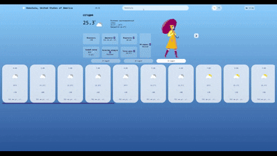
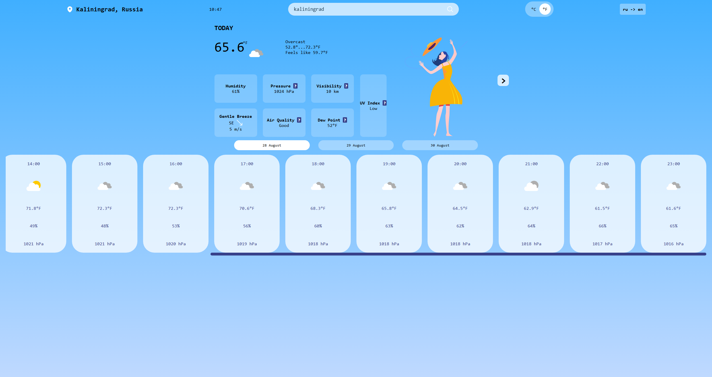
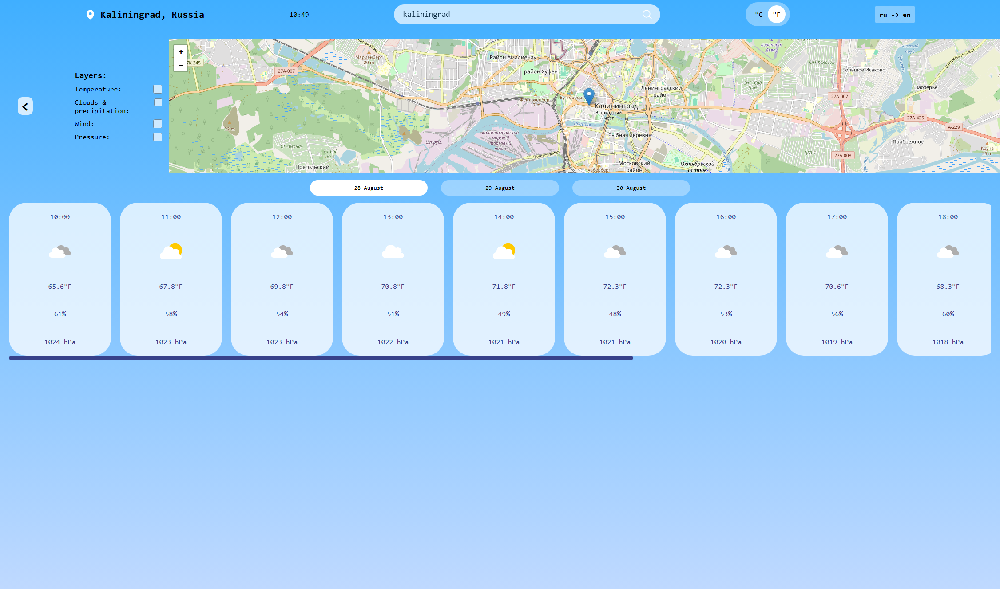
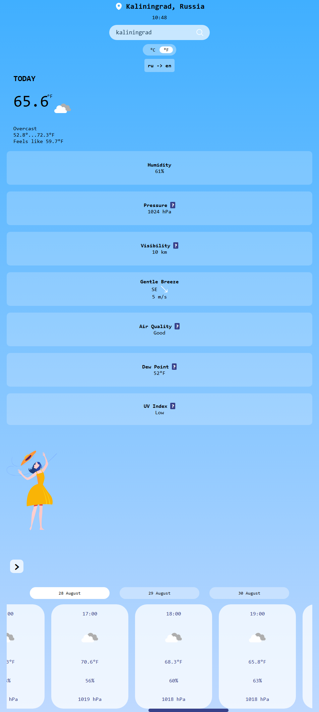
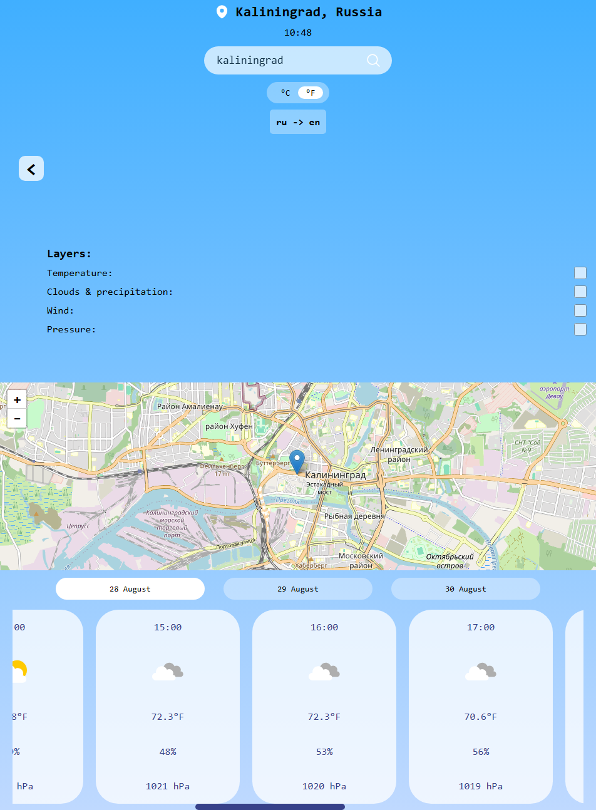

# Weather App

Powered by <a href="https://www.weatherapi.com/" title="Free Weather API">WeatherAPI.com</a> and <a href="https://openweathermap.org/api/" title="OpenWeatherMap API">OpenWeatherMap.org</a>

## Technologies

<ul>
  <li><code>React</code></li>
  <li><code>TypeScript</code></li>
  <li><code>i18next</code></li>
  <li><code>leaflet</code>, <code>react-leaflet</code></li>
</ul>

## Features

<ul style="list-style-type: none;">
  <li>✓ - finds weather forecast based on your IP location, as well as through search</li>
  <li>✓ - custom weather icons + custom spinner (made in SVGATOR)</li>
  <li>✓ - map view with temperature, wind, percipitation + clouds, pressure layers</li>
  <li>✓ - AQI and UV information</li>
  <li>✓ - tooltips with additional information</li>
  <li>✓ - en/ru translation</li>
</ul>

## Running the project

1. YYou need an OpenWeather Account and a WeatherAPI account., follow the instructions <a href="https://openweathermap.org/api">here</a> and <a href="https://www.weatherapi.com/signup.aspx">here</a> to create an account and grab an API key.

2. Clone the repository

<code>git clone https://github.com/Anna-Gladush/Weather-App.git</code>

3. Install the packages using the command <code>npm install</code>

4. Create a <code>.env</code> file in the root directory of the project. Add the following properties in it:

<code>VITE_WEATHER_API=`<your WeatherAPI Key>`</code>

<code>VITE_OPENWEATHER_API=`<your OpenWeather API Key>`</code>

## Live Preview

  
  

## Metrics

## How to improve?

- fix issue with 3rd party cookies (svgator, ip)

## What I learned

How to work with Leaflet, weatherAPI, and OpenWeatherMap API; practiced custom useHooks;

## Resources:

- Woman in different seasons illustration set: <a href="https://www.freepik.com/free-vector/woman-different-seasons-set_5889720.htm#fromView=search&page=1&position=33&uuid=a92f24d5-e6d9-4acc-a5eb-562bfe6613e8&query=human+weather">Image by pch.vector on Freepik</a>
